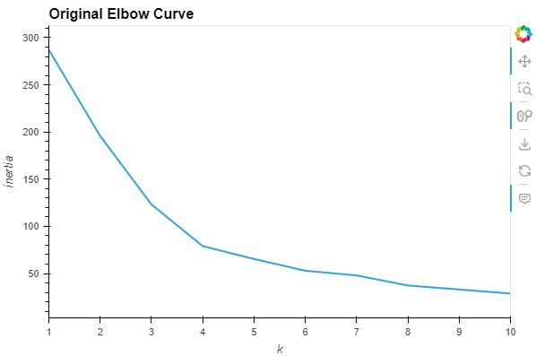
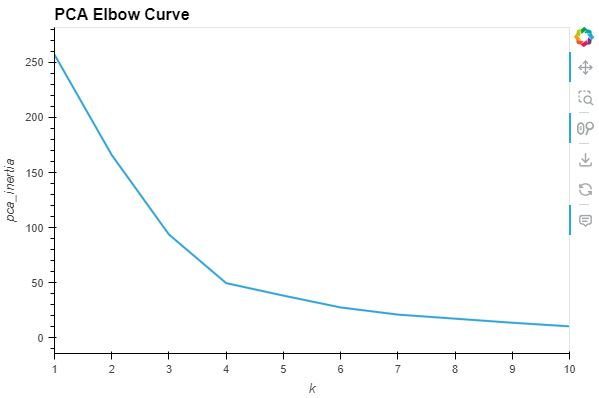
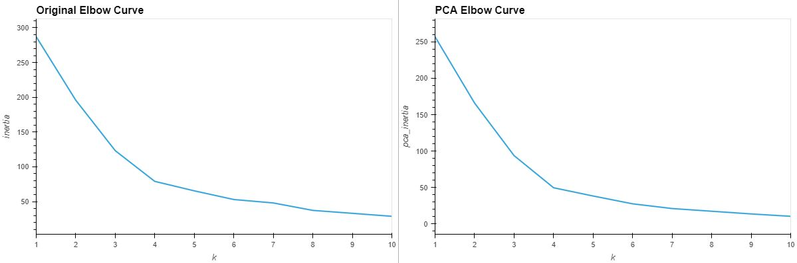
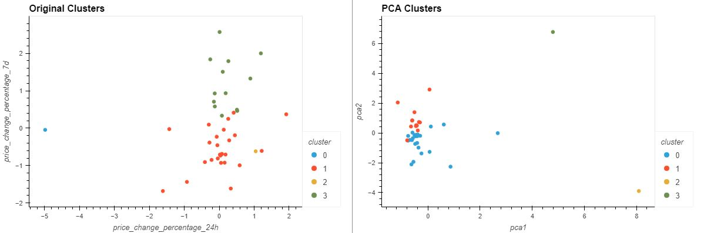

# Module 19 - Crypto Clustering
*Unsupervised Machine Learning Challenge - Week 19 - Data Analytics Boot Camp - University of Oregon*

## Background
This project uses Python (with KMeans, PCA, and StandardScaler libraries) for unsupervised learning to predict if cryptocurrencies are affected by 24-hour or 7-day price changes.

## Original Data Clustering vs Optimized Data Clustering

###  Original Scaled DataFrame

* **Question:** What is the best value for `k`?

  * **Answer:**  Based on the visual representation of the elbow curve, 4 seems like the best k-value.  

### Optimize Clusters with Principal Component Analysis

**PCA Explained Variance Ratios:**  0.3719856 , 0.34700813, 0.17603793

* **Question:** What is the total explained variance of the three principal components?

    * **Answer:** The total of the 3 principle components makes up approximately 89.4% of the data.

* **Question:** What is the best value for `k` when using the PCA data?

  * **Answer:**  Based on the elbow curve, 4 seems to be the most appropriate choice as the curve starts to flatten out at this point.

* **Question:** Does it differ from the best k value found using the original data?

  * **Answer:** It seems to match the result of k-value in the original data.

### Visualize and Compare the Results

  * **Question:** After visually analyzing the cluster analysis results, what is the impact of using fewer features to cluster the data using K-Means?

    * **Answer:** Using the PCA to keep only the most impactful information reduces the noise in the data.  As a result, clearer clusters can be observed, as well as outliers.  This makes it easier to interpret.